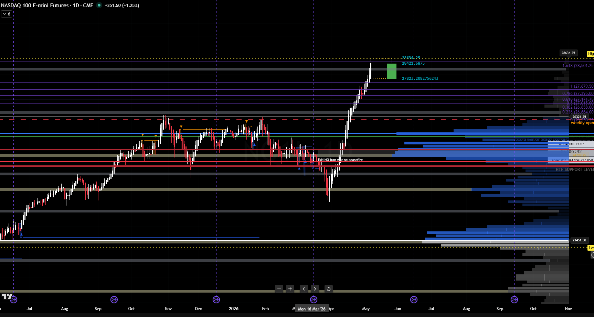
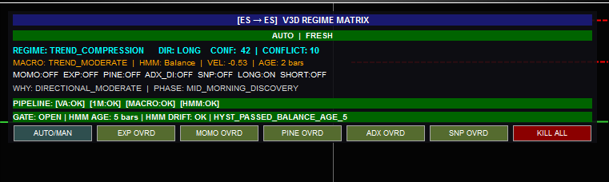
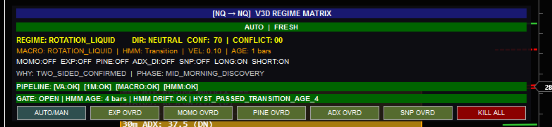

# Regime Expansion Opportunity Audit - NQ May 6, 2026

## Executive Summary

The screenshots and live/latest regime files support the concern: NQ was displaying strong expansion evidence while the regime stack kept Expansion and most directional lanes closed.

The issue is not a single bad HUD label. It is a layered gating failure:

1. V3D NQ at 10:45 had Macro=TREND/TREND_MODERATE but HMM=Balance, ConflictScore=0.40, TwoSidedFlag=1, VelocityConfirmed=0, and FinalRegime=TRANSITION. That blocked Expansion, Momo, and Sniper.
2. V3C NQ around 10:46 had HMM_Micro=TrendUp, IBExtensionPct=0.0897, CloseVsVwapAtr=1.36, NetMoveAtr=2.50, and DevelopingInitiativeScore=64.06, but Macro stayed BRACKET_MACRO/ROTATION_ILLIQUID, so the supervisor promoted only to TREND_COMPRESSION.
3. By the latest V3C snapshot, NQ was even more directional: IBExtensionPct=0.3706, CloseVsVwapAtr=2.88, NetMoveAtr=5.85, HMM_Micro=TrendUp, HMMStateAge=20, SameSideVwapMinutes=80. It still resolved to TREND_COMPRESSION and kept AllowExpansionBot=False because Macro remained ROTATION_ILLIQUID.
4. In V3D, the named exception path `TRANSITION_MACRO_VELOCITY_IB_CONFIRMED` currently returns TREND_COMPRESSION, not TREND_EXPANSION. This means the emergency escape route from Transition cannot wake the Expansion bot even when it confirms velocity plus IB extension.
5. V3D trade logging remains analytically impaired: V3D_TradeLog.csv has 3,745 rows and all 3,745 rows have `entry_regime=UNAVAILABLE`. The three dedicated V3D Expansion/Momentum/Sniper trade logs are header-only.

Bottom line: today looked like an expansion day on price, but the supervisors are designed to be macro/HMM-confirmation-first. When Macro lags or HMM is Balance/Transition, the stack either blocks completely or downgrades into TREND_COMPRESSION. That explains the lack of Expansion trades.

## Included HUD / Chart Images

- `images/01_NQ_daily_trend_expansion_chart_20260506.png`
- `images/02_ES_V3D_HUD_trend_compression_20260506.png`
- `images/03_NQ_V3D_HUD_rotation_liquid_20260506.png`







## Key Evidence Snapshot

See `evidence/regime_gating_snapshot_summary.csv` for the machine-readable version.

| Source | Time | Macro | HMM | Candidate | Final | Reason | Expansion | Momo | Blocking Features |
|---|---:|---|---|---|---|---|---:|---:|---|
| V3D NQ 10:45 | 2026-05-06 10:45 | TREND_MODERATE | Balance | n/a | TRANSITION | HIGH_CONFLICT | 0 | 0 | ConflictScore 0.40, TwoSidedFlag 1, VelocityConfirmed 0, HMM Balance |
| V3D NQ latest | 2026-05-06 11:35 | ROTATION_LIQUID | Transition | n/a | ROTATION_LIQUID | TWO_SIDED_CONFIRMED | 0 | 0 | TwoSidedFlag 1, choppy flips, transition cooldown |
| V3C NQ 10:46 | 2026-05-06 10:46 | ROTATION_ILLIQUID | TrendUp | TREND_COMPRESSION | TREND_COMPRESSION | DEVELOPING_INITIATIVE_PHASE_AWARE | False | True | Macro bracket/rotation blocks Expansion |
| V3C NQ latest | 2026-05-06 11:57 | ROTATION_ILLIQUID | TrendUp | TREND_COMPRESSION | TREND_COMPRESSION | MICRO_TREND_INSIDE_MACRO_STRUCTURE | False | True | Macro still bracket/rotation despite strong price evidence |

## Specific Failure Modes

### 1. V3D conflict override blocks first

At 10:45 V3D had `ConflictScore=0.4`, exactly at the V3D threshold. In `RegimeSupervisor_V3D.py`, the first priority branch returns Transition when conflict meets the threshold:

```text
lines 591-593: if conflict_score >= CONFLICT_THRESHOLD: return TRANSITION / HIGH_CONFLICT
```

Because this fires before trend expansion classification, the model never reaches the expansion path.

### 2. V3D transition exception cannot produce expansion

The V3D exception path is close to the right idea, but it returns compression:

```text
RegimeSupervisor_V3D.py lines 598-607:
if macro_regime == TREND and hmm_regime == Transition and velocity + IB extension confirm:
    return TREND_COMPRESSION, reason TRANSITION_MACRO_VELOCITY_IB_CONFIRMED
```

This is the architectural core: the exception path cannot wake Expansion. It can only open compression-style bots.

### 3. V3C bracket initiative also caps at compression

V3C has two paths that catch directional evidence inside bracket/macro uncertainty, but both cap at TREND_COMPRESSION unless the score is very high or HMM/VWAP/velocity/IB all agree.

Relevant script areas:

```text
RegimeMatrixSupervisor.py lines 760-782: DEVELOPING_INITIATIVE_PHASE_AWARE defaults to TREND_COMPRESSION.
RegimeMatrixSupervisor.py lines 784-806: BRACKET_MACRO_WITH_INITIATIVE_EVIDENCE returns TREND_COMPRESSION.
RegimeMatrixSupervisor.py lines 841-864: TREND_EXPANSION requires HMM trending + VWAP agreement + IB extension + velocity.
```

On May 6, V3C NQ had HMM TrendUp and strong VWAP/net move by the latest snapshot, but Macro stayed BRACKET_MACRO/ROTATION_ILLIQUID and Velocity3CP was negative/low at the snapshot. The logic therefore did exactly what it was written to do: classify as compression.

### 4. TwoSided flags remain sticky after breakout evidence

Both V3D and V3C still showed two-sided flags after the market was visibly extended above VWAP/IB. That is a blocker or confidence suppressor in the current architecture. The flag needs a decay or invalidation rule after confirmed one-sided acceptance.

Recommended clearing rule:

```text
Clear TwoSidedTradeFlag when any of these are true:
- IBExtensionPct >= expansion_ib_ext and SameSideVwapMinutes >= 10
- abs(CloseVsVwapAtr) >= 1.5 and abs(NetMoveAtr) >= 2.5
- N consecutive bars close on same side of VWAP with DirectionalEfficiency above threshold
```

### 5. Trade log regime context is unavailable

Evidence file `evidence/v3d_trade_log_summary.csv` confirms:

```text
V3D_TradeLog.csv rows: 3745
entry_regime UNAVAILABLE rows: 3745
V3D_Expansion_A_TradeLog.csv: 0 rows
V3D_Momentum_A_TradeLog.csv: 0 rows
V3D_Sniper_A_TradeLog.csv: 0 rows
```

Without entry regime context, the model cannot be audited reliably at fill time. This should be fixed alongside regime promotion.

## Recommendations

### Immediate diagnostics

1. Confirm the live V3D HUD fields at the same time as the Latest CSV:
   - FinalRegime
   - HMMRegime
   - MacroPlaybook
   - IBExtensionPct
   - TwoSidedFlag
   - VelocityConfirmed
   - ConflictScore
   - BlockedReason

2. Verify whether the V3D expansion path is intended to be unreachable under Transition exception. If not, change the exception branch to produce TREND_EXPANSION when IB extension, VWAP separation, and velocity exceed strong thresholds.

3. Fix V3D trade log enrichment so `entry_regime`, `entry_direction`, `entry_confidence`, and permission flags are captured from the active HUD at fill time.

### Code-level changes to consider

1. Add an explicit IB breakout override lane.

Suggested condition:

```text
Macro in TREND or BRACKET_MACRO
HMM in TrendUp/TrendDown OR HMM stale/Transition with price-confirmed override
IBExtensionPct >= expansion_ib_ext
abs(CloseVsVwapAtr) >= 1.25
abs(NetMoveAtr) >= 2.0
ReturnedToOpenFlag == 0
SameSideVwapMinutes >= 10
```

Suggested output:

```text
FinalRegime = TREND_EXPANSION
ReasonCode = IB_BREAKOUT_VWAP_ACCEPTANCE_OVERRIDE
AllowExpansion = true
AllowMomo = true
```

2. Convert the `TRANSITION_MACRO_VELOCITY_IB_CONFIRMED` path from compression-only to expansion-capable. A conservative version could require a higher confidence threshold before returning expansion, otherwise return compression.

3. Add rolling decay to TwoSidedTradeFlag.

4. In V3C, let `BRACKET_MACRO_WITH_INITIATIVE_EVIDENCE` promote to TREND_EXPANSION when the bracket has clearly broken:

```text
if developing_score >= 70
and IBExtensionPct >= expansion_ib_ext
and abs(CloseVsVwapAtr) >= vwap_confirm_atr
and abs(NetMoveAtr) >= net_move_confirm_atr:
    candidate = TREND_EXPANSION
```

5. Ensure Momo and Expansion bot permissions are not both zero when FinalRegime is TREND_COMPRESSION with high initiative and long direction. If Expansion remains off by design, Momo should be open if confidence and conflict pass.

## Final Read

The market evidence shown in the NQ daily chart and current CSVs supports a directional opportunity. The model is not seeing it as Expansion because its current supervisory architecture treats Macro/HMM disagreement and stale two-sided evidence as dominant blockers. The safest fix is not to remove these guards, but to add a price-confirmed IB/VWAP acceptance override that can bypass HMM/Macro lag only when price evidence is very strong.
