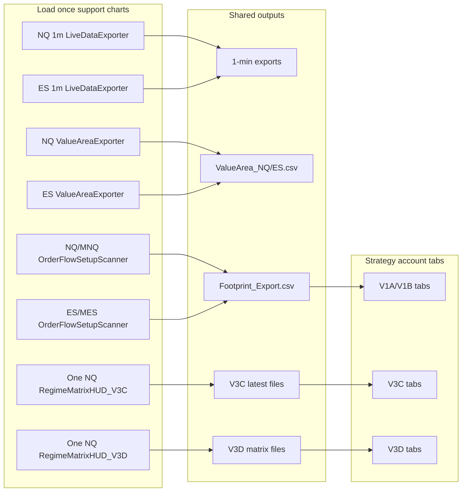

# Operator Operational Loadout - Simple View

Use this as the visual setup map. The key distinction is:

- Load-once services run on one independent support chart.
- Strategy tabs are the actual account/test charts from the registry.

## 1. Load-Once Support Charts

These do not need to be loaded on every strategy chart.

| Support item | Load on | How many | Required for | Output/check |
|---|---:|---:|---|---|
| `LiveDataExporter` | NQ 1-minute chart | 1 | V3C/V3D macro/HMM feed | `Exports\NQ_1min_export.txt` updates |
| `LiveDataExporter` | ES 1-minute chart | 1 | ES macro/HMM feed and ES audit coverage | `Exports\ES_1min_export.txt` updates |
| `ValueAreaExporter` | NQ value-area chart | 1 | NQ VAH/VAL/POC inputs | `Exports\ValueArea_NQ.csv` updates |
| `ValueAreaExporter` | ES value-area chart | 1 | ES VAH/VAL/POC inputs | `Exports\ValueArea_ES.csv` updates |
| `OrderFlowSetupScanner` | NQ/MNQ volumetric footprint chart | 1 | V1B Mode B and footprint audit feed | `Active\Footprint_Export.csv` gets NQ/MNQ rows |
| `OrderFlowSetupScanner` | ES/MES volumetric footprint chart | 1 | ES footprint audit feed | `Active\Footprint_Export.csv` gets ES/MES rows |
| `RegimeMatrixHUD_V3C` | NQ 1-minute leader chart, or any stable NQ chart | 1 | All NQ V3C strategy tabs | HUD fresh; reads `V3C\NQ_Regimes_V3C_Latest.csv` |
| `RegimeMatrixHUD_V3C` | ES leader chart only if ES V3C testing is active | 1 optional | ES V3C strategy tabs | HUD fresh; reads `V3C\ES_Regimes_V3C_Latest.csv` |
| `RegimeMatrixHUD_V3D` | NQ 1-minute leader chart, or any stable NQ chart | 1 | All NQ V3D strategy tabs | HUD fresh; reads `V3D\NQ_RegimeMatrix_Latest.csv` |
| `RegimeMatrixHUD_V3D` | ES leader chart only if ES V3D testing is active | 1 optional | ES V3D strategy tabs | HUD fresh; reads `V3D\ES_RegimeMatrix_Latest.csv` |
| `HUDMessenger` / `HUDMessengerV1B` | Installed/compiled indicator library | Compile once | V1A/V1B shared context and daily bias | Available in NinjaTrader indicator list |
| `ValueAreaBackfillReporter` | Any support chart when repair is needed | On demand | VAH/VAL/POC backfill repair | Use only if value-area exports are missing/stale |

## 2. Background Processes

These are windows/processes, not chart indicators.

| Model | Start file | Must stay open |
|---|---|---|
| V3C | `Master_Keys\V3C_START.bat` | V3C ModelFeed Watchdog; V3C Regime Matrix Supervisor |
| V3D | `Master_Keys\V3D_START.bat` | V3D Stage A MacroRegime; V3D Stage B HMMWatchdog; V3D Stage C Supervisor |
| All models EOD | `Master_Keys\ALL_MODELS_EXPORT.bat` | Creates unified daily trade log and reports |

## 3. Strategy Tabs

Only these items are per chart/tab:

| Model group | Per-tab requirement | Do not duplicate on every tab |
|---|---|---|
| V1A/V1B | Strategy, exact Sim account, correct template, correct Mode A/A+/B settings, trade logger/account filter if used | `LiveDataExporter`, `ValueAreaExporter`, `OrderFlowSetupScanner`, V3C/V3D HUDs |
| V3C | Strategy, exact SimV3C account, correct template, V3C HUD visibility through `InstancesV3C`, V3C-stamped trade logging | `RegimeMatrixHUD_V3C` on every tab; one leader HUD is enough |
| V3D | Strategy, exact SimV3D account, correct template, V3D HUD visibility through `InstancesV3D`, V3D-stamped trade logging | `RegimeMatrixHUD_V3D` on every tab; one leader HUD is enough |

## 4. Visual Map

## 5. Fast Morning Check

- [ ] One NQ `LiveDataExporter` chart is writing.
- [ ] One ES `LiveDataExporter` chart is writing.
- [ ] One NQ `ValueAreaExporter` chart is writing.
- [ ] One ES `ValueAreaExporter` chart is writing.
- [ ] One NQ/MNQ `OrderFlowSetupScanner` chart is writing.
- [ ] One ES/MES `OrderFlowSetupScanner` chart is writing.
- [ ] One NQ `RegimeMatrixHUD_V3C` chart is fresh when V3C is active.
- [ ] One NQ `RegimeMatrixHUD_V3D` chart is fresh when V3D is active.
- [ ] V3C and V3D process windows are open if those models are being tested.
- [ ] Strategy tabs match the account registry.

## 6. Trade Logging Reminder

Trade logging is per strategy/account, but the shared data exporters are not.

- V1A/V1B: use V1A/V1B logging and confirm `ModelVersion`/account filter are correct.
- V3C: V3C accounts must stay V3C-stamped in unified logs.
- V3D: V3D accounts must stay V3D-stamped in unified logs.
- V3D directional lanes should not fire from `HMM=Transition`.
